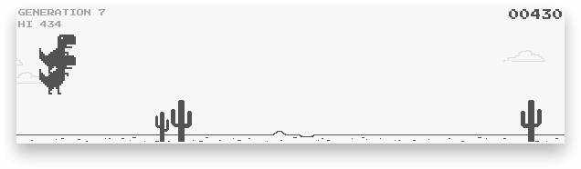

<h1 align="center">
  <br>
  <a href="https://chrisdothtml.github.io/chrome-dino-ai"></a>
  <br>
  <br>
</h1>

> Did you think that dinosaurs were finished evolving?

Forked from my [chrome-dino](https://github.com/chrisdothtml/chrome-dino) repo, attempting to train a neural network via evolution to beat the chrome offline dinosaur game

## Run locally (literally)

```bash
# install deps
$ yarn
# start server
$ yarn start
```

## License

[MIT](license)
